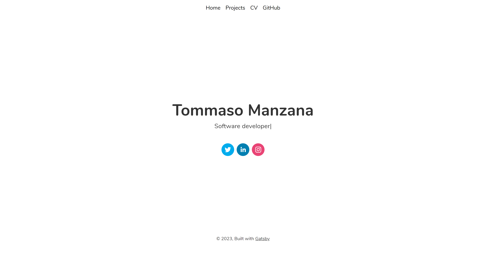
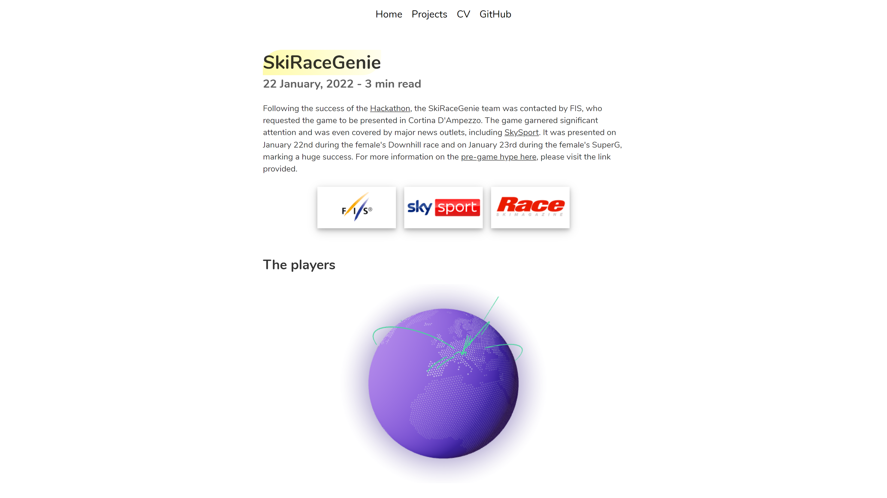
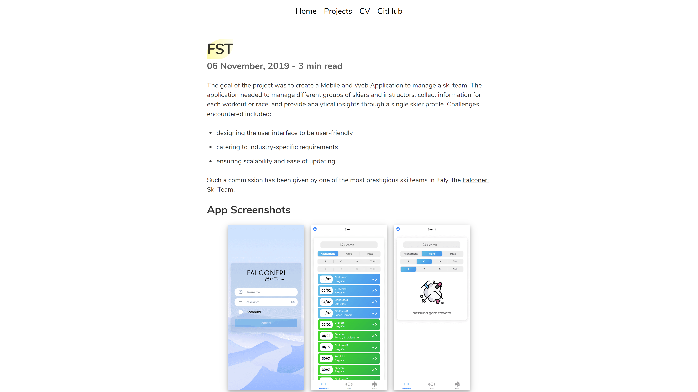

<h1 align="center">
  My Portfolio
</h1>

This repository contains my portfolio website, showcasing some of my projects as well as my CV. Please note that some projects are protected under a non-disclosure agreement and therefore cannot be displayed here. Built using GatsbyJS.

## Screenshots :framed_picture:

  

  

  

