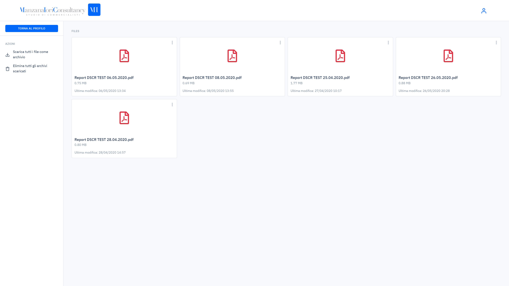
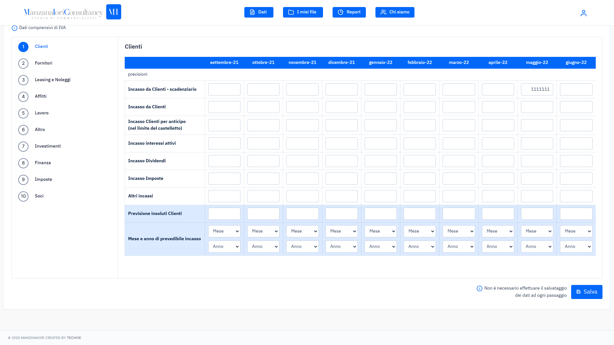
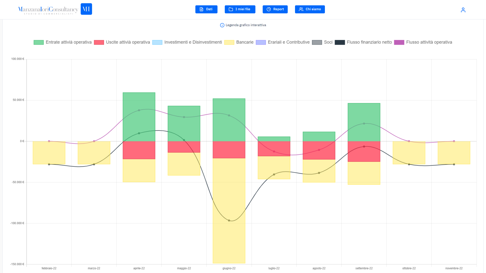
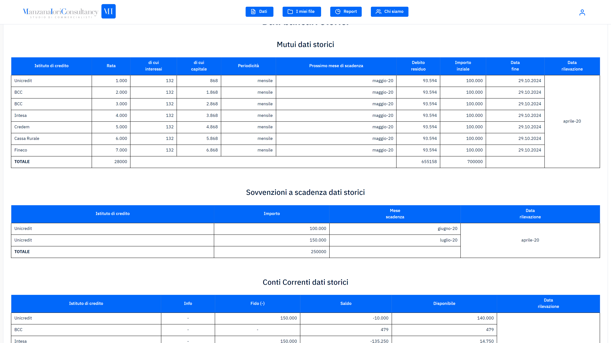

Under the commission of a local business consultant, a WebApp to compute future COVID19-related financial losses was born. New users were requested to input all the necessary data for the generation of the report, whereas those who were already clients of the consultant would be capable of modifying such data since it was alredy in their database.
 
With real-time computation a report could be generated with live charts that gave the possibility of a real-time analysis based on the input. A series of tables would then show where the business would incur losses separated by a number of parameters. All the reports could then be saved in PDF format and could be downloaded in the appropriate "files" section.

## Tools

As requested, all the data processing needed to pass through proprietary Excel. The front end was basic HTML5 with the popular [chart.js](https://www.chartjs.org/) library. The backend was implemented completely in PHP, most notably the core of the project was done with PHPSpreadsheet.

## WebApp Screenshots

    

        
    

    

        
    

    

        
    

    

        
    

    

        
    

