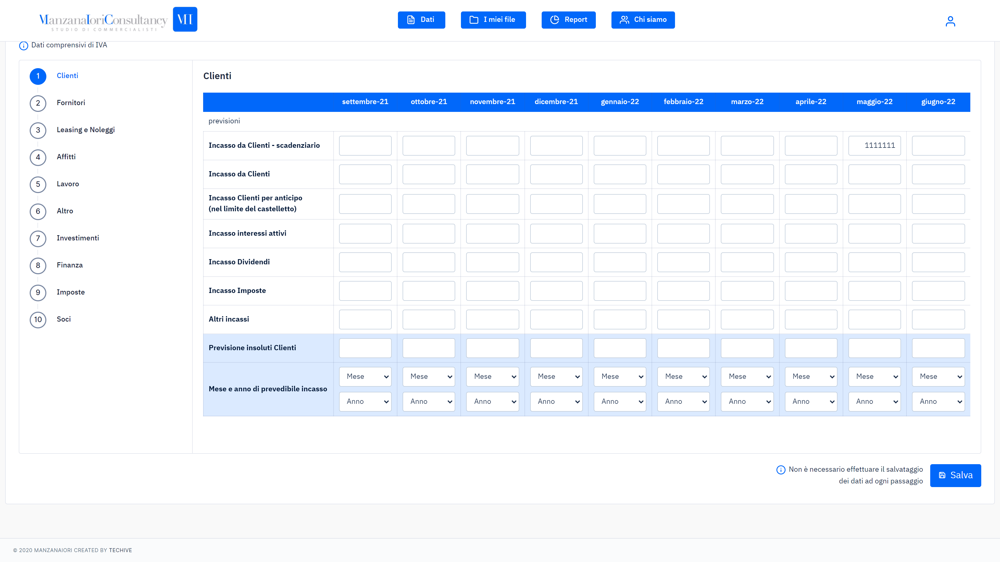
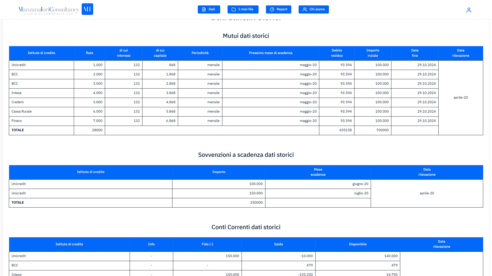

Under the commission of a local business consultant, a WebApp to compute future COVID19-related financial losses was born. New users were requested to input all the necessary data for the generation of the report, whereas those who were already clients of the consultant would be capable of modifying such data as it was alredy present in their database.

Given the real-time computation, the user could interact with live charts based on their input. In addition to the charts, a series of tables would show where and when the business would incur losses. The reports were made available for download in PDF format  and were also saved in the designated "files" section of the user's account.

## Tools

To develop this WebApp, I used several technologies, including HTML5, [chart.js](https://www.chartjs.org/), and PHP. The front end of the application was built with basic HTML5 and chart.js, a popular charting library that allowed me to create interactive charts with ease. The backend was implemented entirely in PHP, with the core of the project being developed using PHPSpreadsheet. Additionally, as requested by the client, all data processing needed to pass through proprietary Excel.

## Learning Experience

Working on this project taught me to develop data processing and live analysis applications, including working with financial proprietary Excel, enhancing my skills in complex data processing. I faced the challenge of creating a real-time analysis system with Chart.js. The experience of designing and developing an application meeting the client's specific requirements from start to finish was invaluable.

## WebApp Screenshots

  

    
  

  

    
  

  

    
  

  

    
  

  

    
  

