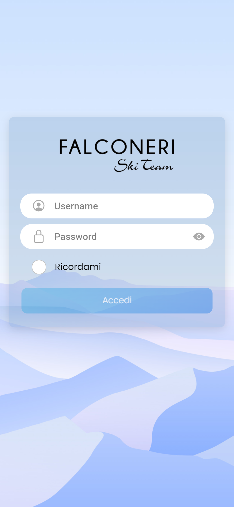
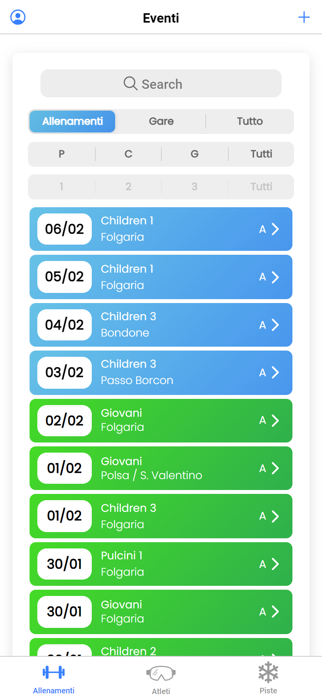
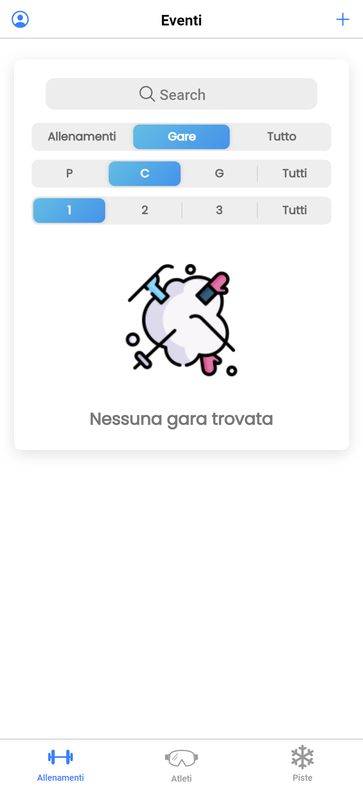
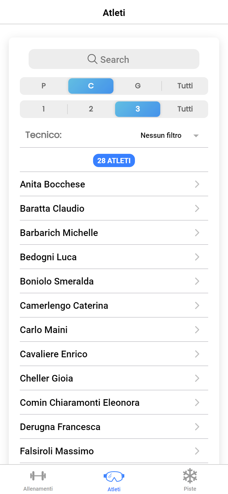
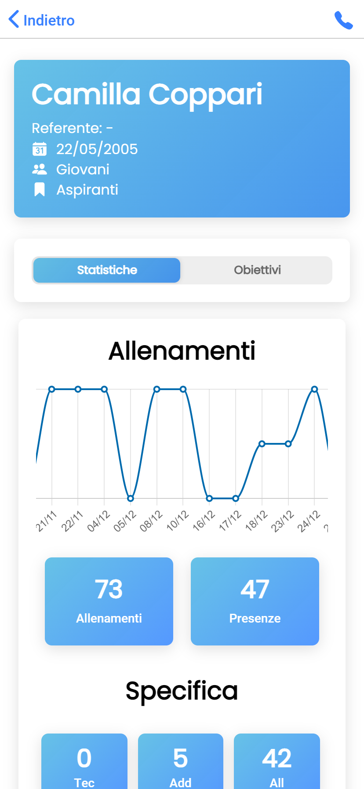
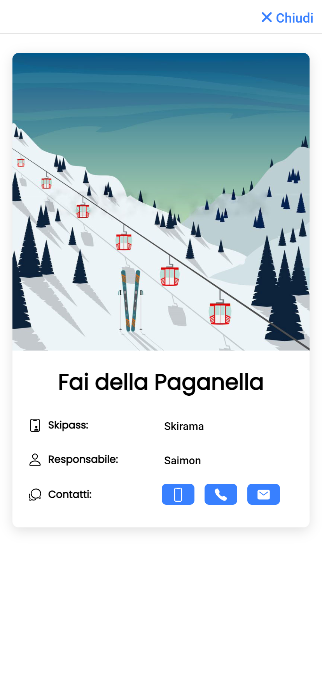

The goal was to develop a Mobile App as well as a Web App capable of managing a ski team. Such a commission has been given by one of the most prestigious ski teams in Italy, the [Falconeri Ski Team](https://falconeriskiteam.net/).
Here are some of the hurdles:

- Manage different groups / categories of skiers & instructors
- Collect enough info for each workout / race in a straightforward manner
- Single skier profile with some analysis

## App Screenshots

    

        
    

    

        
    

    

        
    

    

        
    

    

        
    

    

        
    

## Tools

The app was realized using the [Ionic Framework](https://ionicframework.com/), written in [Angular](https://angular.io/). The authentication process was managed using Google's [Firebase](https://firebase.google.com/), the whole backend was recently moved to a proprietary server and developed via SQL.
