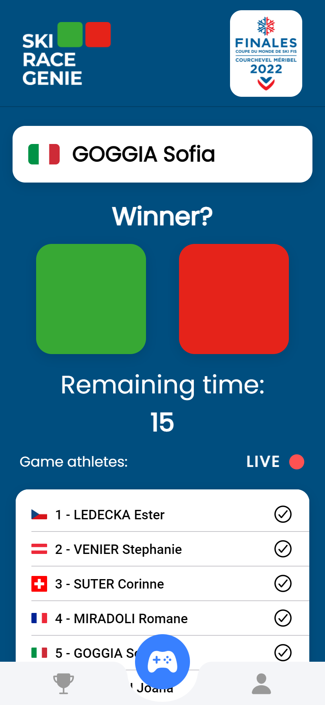
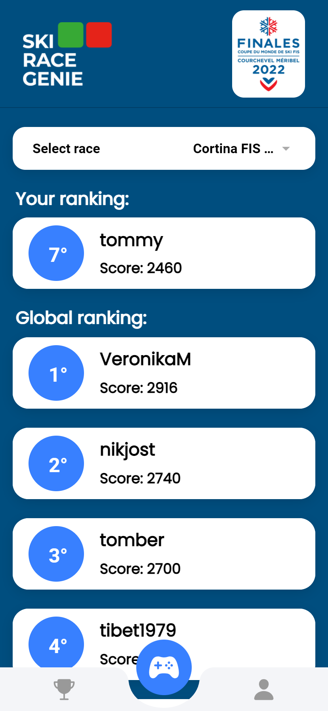

import Globe from "../components/Globe.js"

Following the success of the [Hackathon](/blog/UniTn-Hackathon), the SkiRaceGenie team was contacted by FIS,
 who requested the game to be presented in Cortina D'Ampezzo. The game garnered significant attention 
 and was even covered by major news outlets, including [SkySport](https://sport.sky.it/altri-sport/sci/2022/01/21/sci-cortina-app-fan-engagement).
 It was presented on January 22nd during the female's Downhill race and on January 23rd during the female's SuperG, 
 marking a huge success. For more information on the [pre-game hype here](https://www.fis-ski.com/en/international-ski-federation/news-multimedia/news-2022/ski-race-genie-the-first-live-fan-engagement-app-in-wintersports#:~:text=SKI%20RACE%20GENIE%20%E2%80%93%20The%20first%20Live%20Fan%20Engagement%20App%20in%20Wintersports&text=Following%20the%20path%20traced%20by,will%20be%20presented%20in%20Cortina.), please visit the link provided.

  

    
  

  

    
  

  

    
  

## The players

<Globe />

## App Screenshots

    

        
    

    

        
    

    

        
    

    

        
    

    

        
    

    

        
    

