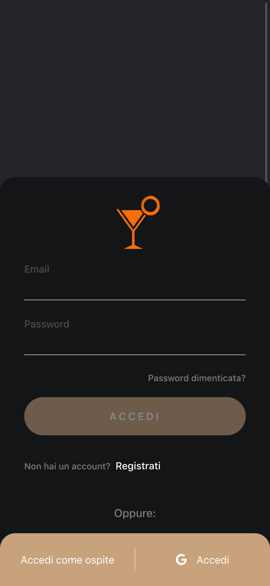
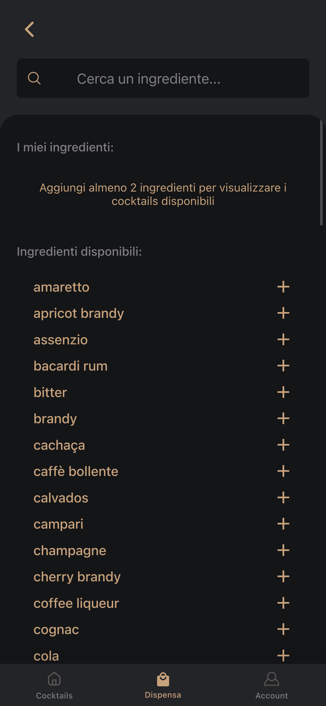
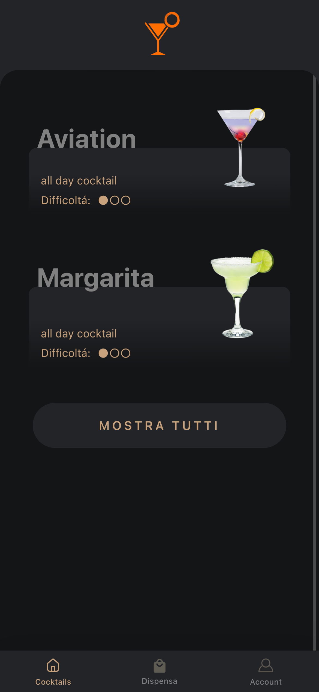
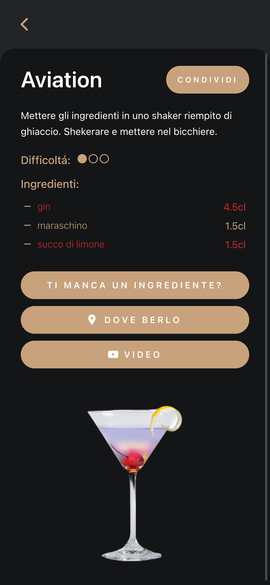
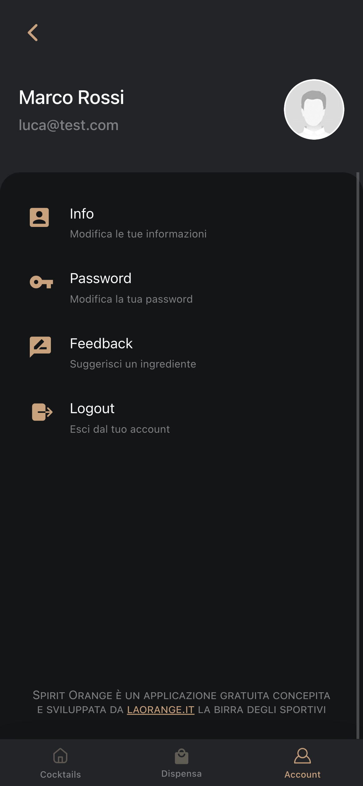
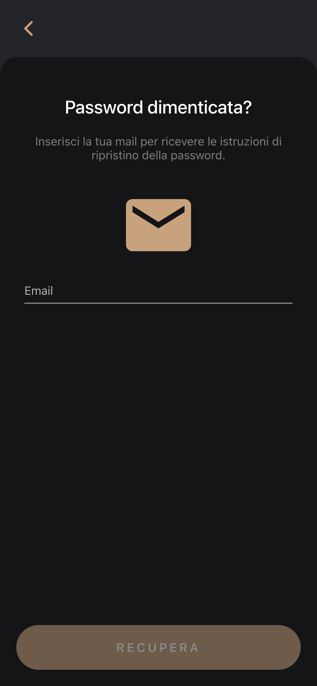

This project involved developing a mobile app that helps users make cocktails using the ingredients they have at home.
The goal was to make cocktail-making simple and accessible to everyone, no matter their level of experience. 
Users simply enter the ingredients they have on hand, and the app generates a list of cocktails they can make with those ingredients.
Each cocktail has a dedicated page that shows the required ingredients and their specific quantities, along with a step-by-step video tutorial on how to make the cocktail.
In addition, the app also provides information on where to drink the cocktail, as well as where to buy any missing ingredients. 
This helps users find local bars and stores that carry the ingredients they need to make their favorite cocktails.

## Tools & Learning Experience

I utilized my expertise in Angular and Ionic for the frontend, and Node.js for the backend. 
Additionally, I gained valuable experience in integrating Google authentication to implement a 
complete sign-in/sign-up flow. This project served as a great opportunity for me to enhance my skills 
and knowledge, specifically in creating a mobile app that is both user-friendly and that provides real value to users.

## App Screenshots

    

        
    

    

        
    

    

        
    

    

        
    

    

        
    

    

        
    

